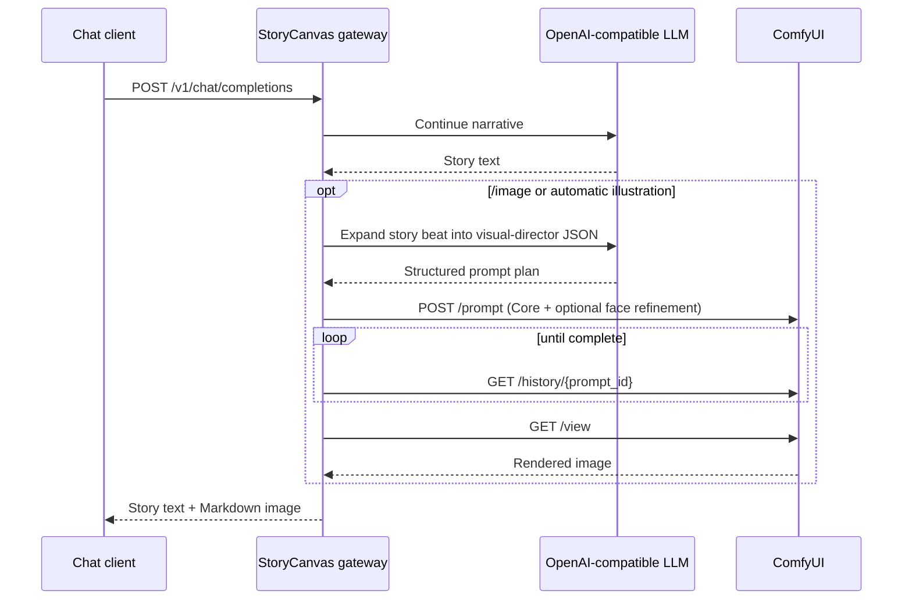

# StoryCanvas AI

StoryCanvas AI is a local-first orchestration gateway for illustrated text adventures. It connects
an OpenAI-compatible language model to a local ComfyUI instance, then appends a generated scene to
the same assistant response. Chatbox, SillyTavern, a custom web client, or any compatible client can
use it through the standard `/v1/chat/completions` API.

> Status: portfolio-ready MVP. The public configuration is intended for general-audience fictional
> adventures and deliberately excludes explicit sexual imagery and graphic gore.


## Why this project exists

Text models maintain narrative continuity well, while image models need short, structured visual
instructions. StoryCanvas separates those responsibilities:

1. The language model advances the interactive story.
2. A second planning pass expands the new story beat into structured visual direction.
3. A Core-node ComfyUI workflow, with optional face refinement, renders it locally.
4. The gateway returns text followed by a WebP image in one OpenAI-compatible response.

## Features

- OpenAI-compatible `/v1/models` and `/v1/chat/completions` endpoints.
- Provider-agnostic text model configuration.
- Local ComfyUI generation with no cloud image API dependency.
- Chinese and English controls: `/图`, `/图开`, `/图关`, `/image`, `/image-on`, `/image-off`.
- Stateful automatic illustration mode.
- Structured visual direction for identity, action, camera, depth, lighting, and materials.
- Single-frame action constraints and robust JSON extraction with deterministic fallback.
- Tiled VAE decoding and batch size 1 for constrained GPUs.
- Optional conservative face refinement that remains disabled in the Core-only profile.
- WebP output, bearer authentication, health checks, and Tailscale-friendly deployment.
- Public demo content policy, automated tests, linting, and GitHub Actions CI.

## Architecture



See [docs/architecture.md](docs/architecture.md) for component boundaries and design decisions.

## Requirements

- Windows 10/11.
- Python 3.11 or newer.
- A working ComfyUI installation and an SDXL-compatible checkpoint.
- An OpenAI-compatible text model API key.
- NVIDIA GPU recommended; 8 GB VRAM works with the default profile.

Model weights and ComfyUI are intentionally not bundled in this repository.

## Quick start

```powershell
git clone https://github.com/YOUR_NAME/storycanvas-ai.git
cd storycanvas-ai
powershell -ExecutionPolicy Bypass -File .\scripts\setup.ps1
```

Edit `.env`:

```dotenv
LLM_API_KEY=your-key
LLM_BASE_URL=https://api.deepseek.com
LLM_MODEL=deepseek-chat
GATEWAY_API_KEY=generate-a-long-random-value
CHECKPOINT_NAME=your-sdxl-checkpoint.safetensors
```

Start ComfyUI on `127.0.0.1:8188`, then run:

```powershell
.\scripts\start.ps1
```

Open [http://127.0.0.1:8000/health](http://127.0.0.1:8000/health) and
[http://127.0.0.1:8000/docs](http://127.0.0.1:8000/docs).

## Client configuration

Use an OpenAI-compatible custom provider:

- API host: `http://127.0.0.1:8000/v1`
- API key: the value of `GATEWAY_API_KEY`
- Model: `storycanvas`

For a phone on the same Tailnet, follow [docs/deployment-windows.md](docs/deployment-windows.md).
Do not use Tailscale Funnel or public router port forwarding.

## Commands

| Command | Effect |
| --- | --- |
| `/图 <action>` or `/image <action>` | Force one illustration after the narrated response |
| `/图开` or `/image-on` | Enable automatic scene illustration |
| `/图关` or `/image-off` | Disable automatic scene illustration |

## Testing

```powershell
.\.venv\Scripts\python.exe -m pytest -q
.\.venv\Scripts\python.exe -m ruff check .
```

The unit suite validates command parsing, public content policy, structured prompt compilation,
the Core workflow, and the optional detected-face refinement path.
Live ComfyUI and provider calls are intentionally kept out of CI.

## Security and privacy

- `.env`, generated images, local profiles, model weights, and state are ignored by Git.
- The API requires a separate gateway bearer key.
- The recommended server bind is localhost; remote access uses Tailscale Serve.
- The public repository contains no chat history, private character profile, dataset, or checkpoint.

Review [SECURITY.md](SECURITY.md) before exposing the service to another device.

## Documentation

- [Architecture](docs/architecture.md)
- [Windows deployment](docs/deployment-windows.md)
- [HTTP API](docs/api.md)
- [Resume/project description](docs/resume.md)
- [Contributing](CONTRIBUTING.md)

## License

MIT. Third-party checkpoints, LoRAs, ComfyUI, and text model services retain their own licenses.
