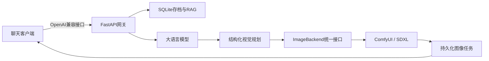

# StoryCanvas AI

**简体中文** | [English](README.md)

StoryCanvas AI 是一套本地优先的多模态交互式故事生成系统。系统通过 OpenAI 兼容接口
调用大语言模型续写故事，使用分存档 SQLite 长期记忆和 RAG 保持剧情连续性，再调用本地
ComfyUI 生成场景插图。Chatbox、SillyTavern、自研前端或其他兼容客户端均可通过
`/v1/chat/completions` 接入。


## 系统流程

1. 客户端提交用户操作或故事指令。
2. SQLite 从当前存档中检索相关长期记忆，并在预算内构建 RAG 上下文。
3. 大语言模型续写本轮故事。
4. 本地提取持久事件并写入当前存档。
5. 视觉规划阶段把最新情节转换为人物、动作、镜头、场景和光照等结构化信息。
6. 统一图像后端调用 ComfyUI 生成 WebP 插图。
7. 网关将故事文本和图片作为同一条 OpenAI 兼容响应返回。

## 主要功能

### 故事与图像生成

- OpenAI 兼容的 `/v1/models` 和 `/v1/chat/completions`；
- 普通 JSON 和 SSE 流式响应；
- 中文、英文和移动端兼容的配图控制命令；
- 结构化视觉规划与确定性容错；
- 本地 ComfyUI、WebP 输出和可选 FaceDetailer；
- 与具体模型解耦的 `ImageBackend` 接口；
- 当前公开后端为 `comfy-sdxl`，后续可接入 Qwen 或增强 SDXL 适配器。

### SQLite与RAG长期记忆

- 按故事存档隔离对话和记忆；
- 标签、实体、重要度、故事时间和内容指纹；
- SQLite FTS5、关键词、中文双字词、时间与重要度混合排序；
- Top-K和字符预算控制；
- 本地记忆抽取，不额外调用一次外部模型；
- 记忆新增、修改、归档、恢复和分页；
- 冲突记忆隔离、旧事实取代和修订链保留。

### 数据、任务和恢复

- 存档新建、重命名、归档、恢复、复制及JSON导入导出；
- 原子化导入和重复存档保护；
- SQLite整库快照、完整性检查和恢复前安全备份；
- 图像任务排队、运行、成功、失败和取消状态；
- 请求ID、ComfyUI任务ID、耗时、错误和重试关系；
- 服务重启后自动标记中断任务；
- 失败或取消任务重试；
- 故事Markdown、清单和本地图片ZIP导出。

### 安全与运维

- 独立网关Bearer Token；
- 默认只监听本机地址；
- 推荐通过Tailscale私网访问；
- 请求ID和JSON结构化日志；
- 日志不记录密钥、请求正文、故事正文或记忆内容；
- `.env`、数据库、图片、备份、模型和本地覆盖层均由Git忽略。

## 系统架构



系统设计详见[架构文档](docs/architecture.md)。

## 环境要求

- Windows 10/11；
- Python 3.11或更高版本；
- 可运行的ComfyUI；
- SDXL兼容模型；
- OpenAI兼容文本模型API；
- 推荐使用NVIDIA GPU，默认参数可在约8GB显存环境中运行。

仓库不包含模型权重、ComfyUI本体或第三方模型许可证内容。

## 快速开始

```powershell
git clone https://github.com/l399535557-ctrl/StoryCanvas-AI.git
cd StoryCanvas-AI
powershell -ExecutionPolicy Bypass -File .\scripts\setup.ps1
```

编辑`.env`：

```dotenv
LLM_API_KEY=your-key
LLM_BASE_URL=https://api.deepseek.com
LLM_MODEL=deepseek-chat
GATEWAY_API_KEY=generate-a-long-random-value
IMAGE_BACKEND=comfy-sdxl
CHECKPOINT_NAME=your-sdxl-checkpoint.safetensors
```

启动监听`127.0.0.1:8188`的ComfyUI，然后运行：

```powershell
.\scripts\start.ps1
```

服务启动后访问：

- 健康状态：<http://127.0.0.1:8000/health>
- 接口文档：<http://127.0.0.1:8000/docs>

## 客户端配置

- API地址：`http://127.0.0.1:8000/v1`
- API密钥：`.env`中的`GATEWAY_API_KEY`
- 模型名称：`storycanvas`

手机访问请参考[Windows部署文档](docs/deployment-windows.md)，建议使用Tailscale Serve，
不要直接开放公网端口。

## 聊天命令

| 命令 | 作用 |
| --- | --- |
| `/图 <操作>`或`/image <action>` | 本轮强制生成插图 |
| `/图开`或`/image-on` | 开启自动配图 |
| `/图关`或`/image-off` | 关闭自动配图 |
| `#图`、`#图开`、`#图关` | 移动端兼容别名 |
| `/存档 <名称>` | 创建或切换故事存档 |
| `/存档列表` | 查看存档及当前存档 |
| `/记忆 <内容>` | 手动写入长期记忆 |
| `/记忆状态` | 查看记忆与检索状态 |

客户端也可以通过`story_save_id`、`conversation_id`或`X-Story-Save-ID`请求头选择存档。

## 测试

```powershell
.\.venv\Scripts\python.exe -m pytest -q
.\.venv\Scripts\python.exe -m ruff check .
```

当前29项测试覆盖命令解析、内容策略、视觉提示编译、图像后端契约、ComfyUI工作流、
存档隔离、RAG、数据库迁移、记忆冲突、任务恢复与重试、备份恢复、请求追踪和作品导出。
真实LLM与ComfyUI调用不进入公共CI，需要在目标设备上进行端到端验收。

## 公开版与完整运行版

当前以公开仓库作为唯一开发主线，早期完整运行版暂时冻结。公开版达到后端验收条件后，
通过适配器接回Qwen、增强SDXL、LoRA、IP-Adapter和ControlNet，并通过本地覆盖层加载
本地专用提示词、私人角色及参考图，不修改公共核心代码。

详见[公开版到完整运行版迁移约定](docs/full-edition-migration.md)。

## 隐私边界

公开仓库不包含：

- API密钥和真实`.env`；
- 聊天历史和SQLite数据库；
- 私人角色、参考图片和本地专用提示词；
- 生成图片、运行日志和数据库备份；
- 模型、LoRA或其他权重文件。

部署到其他设备前请阅读[安全说明](SECURITY.md)。

## 文档

- [当前进度与路线](docs/progress.md)
- [系统架构](docs/architecture.md)
- [Windows部署](docs/deployment-windows.md)
- [HTTP接口](docs/api.md)
- [完整运行版迁移约定](docs/full-edition-migration.md)
- [项目介绍](docs/introduction.md)
- [参与开发](CONTRIBUTING.md)

## 许可证

项目代码使用MIT许可证。第三方模型、LoRA、ComfyUI和文本模型服务分别适用其自身许可证。
