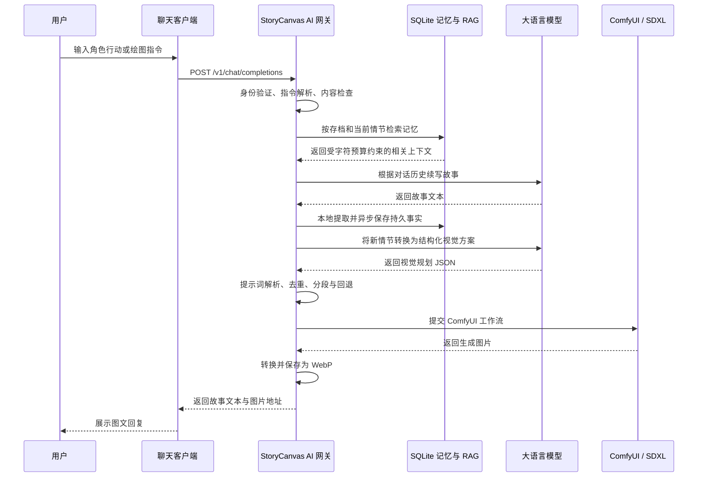

# StoryCanvas AI 毕业设计项目介绍

## 一、项目基本信息

| 项目 | 内容 |
| --- | --- |
| 项目名称 | StoryCanvas AI |
| 建议课题名称 | 基于大语言模型与扩散模型的多模态交互式故事生成系统设计与实现 |
| 项目类型 | 生成式人工智能、多模态内容生成、Web 后端系统、本地 AI 应用 |
| 当前阶段 | 核心后端与主要生成链路已完成，进入完整系统建设阶段 |
| 项目仓库 | [GitHub：StoryCanvas AI](https://github.com/l399535557-ctrl/StoryCanvas-AI) |

## 二、项目背景

近年来，大语言模型能够生成连贯的故事文本，扩散模型能够根据提示词生成高质量图片，但两类模型通常彼此独立。直接将一段较长的故事文本交给图像生成模型，容易出现人物数量错误、角色特征丢失、动作冲突、场景与情节不一致等问题。

StoryCanvas AI 的目标是构建一个本地优先的多模态交互式故事生成系统，将大语言模型的叙事能力与 ComfyUI/SDXL 的图像生成能力组合起来。用户输入角色行动后，系统自动续写故事、分析新情节中的视觉信息、生成场景插图，并将文字和图片作为同一条聊天回复返回。

该项目不仅关注模型调用，也重点研究故事文本到视觉提示词的结构化转换、多个生成模型之间的任务编排，以及有限硬件条件下的本地图像生成与系统稳定性。

## 三、项目目标

本项目拟实现以下目标：

1. 实现能够通过分存档长期记忆持续维护上下文的交互式故事生成。
2. 设计故事生成与视觉规划相分离的两阶段生成流程。
3. 将自然语言故事转换为结构化、可控的图像生成提示词。
4. 调用本地 ComfyUI 和 SDXL 模型生成与故事情节对应的场景插图。
5. 设计统一的 OpenAI 兼容接口，使多种聊天客户端能够接入系统。
6. 针对消费级显卡进行显存、任务并发和图像输出优化。
7. 使用本地混合 RAG 按当前情节检索相关记忆，避免完整历史持续挤占上下文窗口。
8. 在后续研究中评估结构化视觉规划对图文一致性的改善效果。

## 四、系统总体架构

系统由聊天客户端、StoryCanvas 网关、SQLite 长期记忆与 RAG、大语言模型服务和本地
ComfyUI 五部分组成。



### 4.1 聊天客户端

系统不绑定特定前端。任何支持 OpenAI Chat Completions 接口的客户端都可以接入，例如 Chatbox、SillyTavern、NativeTavern 或自行开发的 Web 客户端。

### 4.2 StoryCanvas AI 网关

网关是系统的核心编排层，负责：

- 验证客户端身份；
- 解析中文、英文绘图控制指令；
- 维护自动插图开关状态；
- 解析存档标识、检索相关记忆并注入受限上下文；
- 在本地提取持久事实并异步写入 SQLite；
- 调用大语言模型生成故事；
- 调用视觉规划模型生成结构化提示词；
- 构建并提交 ComfyUI 工作流；
- 轮询图像任务状态；
- 保存图片并组合最终图文回复。

### 4.3 大语言模型服务

大语言模型在系统中承担两个相互分离的任务：

1. **故事生成**：根据完整对话历史、系统提示词和故事设定续写剧情。
2. **视觉规划**：仅针对用户当前行动及最新故事结果，提取生成插图需要的视觉信息。

这种设计避免将整段对话历史直接作为扩散模型提示词，降低无关信息、时间线描述和相互冲突的动作对图片生成的干扰。

### 4.4 ComfyUI 图像生成服务

系统通过 ComfyUI HTTP API 动态提交工作流，调用本地 SDXL 兼容模型进行图片生成。默认工作流只依赖 ComfyUI Core 节点，也可以选择启用 FaceDetailer 对检测到的人脸区域进行低重绘强度的细节修复。

### 4.5 SQLite 长期记忆与本地 RAG

每个故事存档使用独立的 `save_id` 隔离对话与记忆。记忆记录包含类型、正文、标签、
实体、重要度、故事时间和访问统计，并使用内容指纹去重。检索综合 SQLite FTS5、英文
词项、中文双字词、重要度和时间衰减进行排序，只把 Top-K 结果在固定字符预算内注入
模型。记忆抽取在本机以确定性规则完成，不额外发送一次外部模型请求。

## 五、核心功能

### 5.1 交互式故事续写

系统根据对话历史、角色设定和用户当前行动生成后续情节，并要求模型保持世界观、人物动机和剧情关系的连续性。

### 5.2 两阶段生成流程

系统将文学创作和视觉规划拆分成两次模型调用：

```text
用户行动
   ↓
故事续写模型
   ↓
新故事情节
   ↓
视觉规划模型
   ↓
结构化视觉描述
   ↓
SDXL 图像生成
```

故事模型可以使用自然、连贯的语言进行创作；视觉规划模型则专注于把故事转化成简洁、稳定且适合扩散模型的英文视觉标签。

### 5.3 结构化视觉提示词

视觉规划结果采用 JSON 格式，并按照以下维度组织：

| 字段 | 作用 |
| --- | --- |
| `subjects` | 主体数量和人物身份 |
| `face_body_identity` | 面部、发型、体型等稳定身份特征 |
| `wardrobe_materials` | 服装、配饰和材质 |
| `action_interaction` | 动作、姿态和人物交互 |
| `camera_composition` | 景别、视角、镜头感和构图 |
| `scene_environment` | 地点、背景和空间层次 |
| `lighting_color` | 主光、补光、轮廓光和综合色彩 |
| `style_quality` | 绘画风格与质量要求 |
| `negative` | 不希望出现的错误内容 |

系统能够从模型返回的普通文本或 Markdown 代码块中提取 JSON，对重复标签进行去重，并使用稳定的 `BREAK` 分区编译最终提示词。如果模型没有返回有效 JSON，系统会使用确定性的默认提示词继续执行，避免整个请求失败。

### 5.4 绘图指令与自动插图

系统支持中英文指令：

| 指令 | 功能 |
| --- | --- |
| `/图 <行动>`、`/image <action>` | 强制为本轮故事生成一张插图 |
| `/图开`、`/image-on` | 开启自动场景插图 |
| `/图关`、`/image-off` | 关闭自动场景插图 |
| `#图`、`#图开`、`#图关` | 兼容部分会占用斜杠指令的移动端客户端 |

自动模式会根据故事内容中是否包含场景、人物外貌、服装、战斗等视觉信息，判断当前回合是否适合生成图片。

### 5.5 OpenAI 兼容 API

系统实现了以下接口：

- `GET /v1/models`：返回 StoryCanvas 虚拟模型信息；
- `POST /v1/chat/completions`：接收聊天请求并返回故事或图文结果；
- `GET /health`：检查配置、ComfyUI 和 GPU 状态；
- `GET /images/{filename}`：提供生成图片访问；
- Server-Sent Events：兼容流式聊天响应格式。

由于采用 OpenAI 兼容协议，文本模型服务可以替换为 DeepSeek、OpenAI、Ollama 或其他兼容服务，聊天客户端也不需要了解内部的 ComfyUI 工作流。

### 5.6 本地图像生成与显存优化

默认 ComfyUI 工作流包含：

- `CheckpointLoaderSimple`：加载模型；
- `EmptyLatentImage`：创建潜空间图像；
- `CLIPTextEncode`：编码正向与负向提示词；
- `KSampler`：执行扩散采样；
- `VAEDecodeTiled`：分块解码；
- `SaveImage`：保存生成结果。

针对 8 GB 左右显存的消费级显卡，项目进行了以下优化：

- 批处理大小固定为 1；
- 使用 Tiled VAE 减少解码阶段的显存占用；
- 使用异步锁将 GPU 生成任务串行化，避免并发任务导致显存溢出；
- 支持调整分辨率、采样步数、CFG、采样器和调度器；
- 将最终图片转换为 WebP，在保持质量的同时降低文件体积；
- 可选启用低重绘强度的 FaceDetailer 人脸细化。

### 5.7 安全与隐私

- 大模型密钥、网关密钥和模型配置通过 `.env` 管理；
- `/v1/*` 接口使用 Bearer Token 鉴权；
- 图片文件名使用随机 UUID；
- 图片访问接口会清理路径信息，降低目录穿越风险；
- 模型权重、生成图片、聊天记录和私有人物设定不提交到公共仓库；
- 默认只监听本机地址；
- 跨设备访问推荐使用 Tailscale 私有网络，不开放公网端口。

### 5.8 分存档长期记忆与 RAG

系统支持 `/存档`、`/存档列表`、`/记忆` 和 `/记忆状态` 指令，也可通过请求字段或
`X-Story-Save-ID` 请求头选择存档。数据库采用 WAL、外键、索引和参数化查询；检索
严格限制在当前存档，并通过 Top-K 与上下文字符预算控制提示词体积。

## 六、主要技术栈

| 分类 | 使用技术 | 用途 |
| --- | --- | --- |
| 编程语言 | Python 3.11 | 系统主要开发语言 |
| Web 框架 | FastAPI、Uvicorn | API 服务、路由与异步请求处理 |
| 数据校验 | Pydantic | 请求模型和配置数据校验 |
| 网络通信 | HTTPX、AsyncIO | 异步调用大语言模型和 ComfyUI |
| 大语言模型 | OpenAI-compatible API | 故事续写和结构化视觉规划 |
| 图像生成 | ComfyUI、SDXL | 本地扩散模型推理与工作流编排 |
| 图像处理 | Pillow、WebP | 图片读取、格式转换和压缩 |
| 接口协议 | REST、OpenAI Chat Completions、SSE | 客户端兼容和流式响应 |
| 状态管理 | JSON、本地文件、线程锁 | 保存自动插图状态 |
| 长期记忆 | SQLite、FTS5、本地混合 RAG | 分存档保存、标签化与相关记忆检索 |
| 网络部署 | Tailscale Serve | 在私有网络中跨设备访问 |
| 测试 | Pytest、FastAPI TestClient | 命令、策略、接口和工作流测试 |
| 代码质量 | Ruff | 代码风格与静态检查 |
| 持续集成 | GitHub Actions | 自动执行检查和测试 |
| 项目构建 | Hatchling、`pyproject.toml` | Python 项目打包与依赖管理 |
| 自动化脚本 | PowerShell、Batch | Windows 环境安装、诊断与启动 |

## 七、项目技术特点与创新点

### 7.1 故事生成与视觉规划解耦

项目没有直接把故事全文交给扩散模型，而是增加视觉规划阶段，将人物身份、动作、镜头、环境和光照等信息拆分后重新编译。这种方法增强了整个生成过程的可解释性和可控制性。

### 7.2 单帧场景约束

故事描述通常包含一段连续事件，但一张图片只能表现某个瞬间。视觉规划提示词要求模型冻结一个关键时刻，避免在一张图片中同时描述前后两个动作，从而减少肢体冲突和构图混乱。

### 7.3 模型和客户端解耦

StoryCanvas 对客户端表现为一个普通的 OpenAI 兼容模型。客户端不需要知道后端实际调用了几次语言模型，也不需要理解 ComfyUI 工作流，使模型服务、图像服务和聊天客户端可以独立替换。

### 7.4 面向有限硬件的工程设计

通过生成锁、单图批处理和 VAE 分块解码，项目能够在普通个人电脑上完成多模态生成，而不完全依赖云端 GPU 服务。

### 7.5 本地优先的隐私架构

生成图片、人物设定和模型权重均可以保存在用户自己的设备上，适用于对原创内容和隐私具有一定要求的写作场景。

### 7.6 有界上下文的长期叙事记忆

系统不把全部历史记录反复发送给模型，而是从当前存档中按情节相关度检索少量记忆。
这种设计兼顾故事连续性、上下文窗口占用、调用成本和隐私，并为后续向量检索与记忆
冲突修订保留扩展接口。

## 八、当前完成情况

目前已经完成：

- FastAPI 网关及 OpenAI 兼容接口；
- 大语言模型故事续写调用；
- 第二阶段结构化视觉规划；
- ComfyUI Core 工作流构建与调用；
- 自动插图和强制插图模式；
- 中英文控制指令；
- 图片 WebP 转换与访问；
- Bearer Token 鉴权；
- JSON 状态持久化；
- SQLite 分存档故事对话与长期记忆；
- 标签、实体、重要度、中文词项和 FTS5 组成的本地混合 RAG；
- 记忆去重、自动提取、受限上下文注入及管理 API；
- 健康检查与错误处理；
- Windows 安装、启动和诊断脚本；
- API、架构、安全和部署文档；
- 命令解析、内容策略、提示词编译、接口和工作流等基础单元测试；
- Ruff 代码规范配置与 GitHub Actions CI。

当前版本已经完成核心后端闭环。后续重点不是继续堆叠复杂算法，而是补齐独立前端、
数据管理、任务状态、异常恢复、成果导出、部署和验收测试，使项目形成能够独立使用的
完整毕业设计工程。

## 九、毕业设计阶段拟扩展内容

### 9.1 系统功能扩展

1. 开发独立的 Web 前端，展示故事对话、生成图片、任务进度和模型配置。
2. 完善存档的新建、重命名、复制、删除、归档和恢复。
3. 增加记忆修改、删除、失效、冲突处理和人工确认。
4. 增加图片生成进度、取消、重试、历史浏览和重新生成。
5. 增加对话分页、故事章节管理和图文统一导出。
6. 补齐结构化日志、错误诊断、数据库备份恢复和端到端测试。

### 9.2 人物一致性研究

进一步研究并比较以下人物一致性方案：

- 仅使用文字描述；
- 固定人物视觉档案；
- 使用参考图片和 IP-Adapter；
- 使用角色 LoRA；
- 对人物面部区域进行二次细化。

### 9.3 实验设计

计划设计以下对比组：

- **基线方案**：直接把故事文本作为图像生成提示词；
- **两阶段方案**：使用结构化视觉规划生成提示词；
- **增强方案**：在结构化视觉规划基础上增加人物一致性约束。

可以从以下指标进行评估：

| 指标 | 评估内容 |
| --- | --- |
| 图文语义一致性 | 图片是否正确表现故事中的人物、动作和环境 |
| 人物属性保持率 | 发型、服装、外貌和人数是否与设定一致 |
| 动作正确率 | 是否出现动作冲突、额外肢体或人物合并 |
| CLIPScore | 文本和图片的自动化语义相似度 |
| 人工主观评分 | 用户对相关性、美观度和故事沉浸感的评分 |
| 生成耗时 | 从接收请求到返回图文结果所需时间 |
| 显存峰值 | 不同分辨率和工作流的显存消耗 |
| 任务成功率 | 不同配置下成功完成图像生成的比例 |

### 9.4 预期论文研究问题

毕业论文可以围绕以下问题展开：

> 与直接使用原始故事文本作为扩散模型提示词相比，基于结构化视觉规划的两阶段生成方法，能否提高图文语义一致性、人物属性保持能力和生成过程的稳定性？

该问题既包含系统实现，也包含可以量化的实验对比，能够避免论文只停留在 API 集成和应用开发层面。

## 十、预期成果

1. 一套可以在 Windows 个人电脑上运行的多模态交互式故事生成系统。
2. 一个独立的 Web 操作界面和完整的后端 API。
3. 一套故事文本到结构化视觉提示词的转换方法。
4. 一套本地 ComfyUI/SDXL 图像生成与任务编排方案。
5. 关于提示词方案、图文一致性、人物一致性和系统性能的实验数据。
6. 完整的毕业设计论文、系统设计文档、部署文档和演示材料。

## 十一、项目可行性分析

### 11.1 技术可行性

核心流程已经实现，项目能够完成从用户输入、记忆检索、故事生成、视觉规划、ComfyUI
出图到图文返回的闭环。后续工作主要是在现有数据库与后端架构上增加独立界面、完整
数据管理、任务生命周期、导出和验收测试，技术路线明确。

### 11.2 硬件可行性

项目已经针对约 8 GB 显存的消费级 NVIDIA 显卡进行设计，通过单张生成、任务串行化和 Tiled VAE 等方式降低运行门槛。

### 11.3 研究可行性

结构化视觉规划与直接提示词之间可以形成明确的对照实验，图文一致性、人物属性保持、延迟和显存等指标也可以被记录和分析，因此具备形成毕业论文实验章节的条件。

### 11.4 工作量分析

当前版本已经覆盖模型调用、提示词处理、工作流编排、接口设计、SQLite 长期记忆、
安全控制、部署和测试。通过补充独立前端、完整数据管理、任务状态、导出、异常恢复
以及端到端验收，整体工作量能够满足本科毕业设计的要求。

## 十二、总结

StoryCanvas AI 是一个面向交互式故事场景的本地多模态生成系统。项目将大语言模型、结构化提示词工程、Stable Diffusion、ComfyUI 工作流和 OpenAI 兼容接口结合起来，实现了文字故事和场景插图的自动联合生成。

相比单纯调用大模型 API 的聊天应用，本项目重点解决了故事长期记忆、故事到视觉信息
的转换、多模型协同、本地 GPU 任务控制、图文结果组合和跨客户端兼容等问题。在现有
核心后端基础上继续完成 Web 界面、数据与任务管理、成果导出、部署验收和少量对比实验，
即可形成一个系统完整、能够稳定演示并具备实验论证的本科毕业设计。
